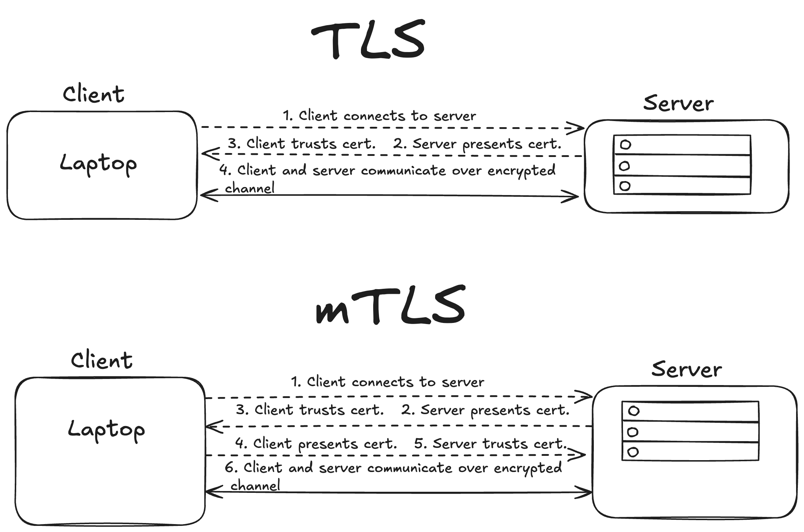

# Mutual Transport Layer Security (mTLS)

In TLS, once the client establishes that they can trust the server, encrypted communication is initiated.

However, in mTLS the server must also establish that they can trust the client. So their must be mutual trust between the client and the server. 

TLS Steps:
1. Client connects to the server.
2. Server presents its certificate.
3. Client trusts certificate as it is signed by an intermediate which links back to root CA.
4. Client and server generate shared secret and commence encrypted communication.

mTLS Steps:
1. Client connects to server.
2. Server presents its certificate.
3. Client trusts certificate as it is signed by an intermediate which links back to root CA.
4. **Client presents its certificate.**
5. **Server trusts certificate as it is signed by and intermediate which links back to root CA.**
6. Client and server generate shared secret and commence encrypted communication.

mTLS is typically used in internal networks that employ a zero trust approach to security. In a Zero Trust approach no device trusts any other device by default, clients and servers must be able to authenticate one another every time they try to communicate with one another. THG perhaps follow a mTLS approach to security on their internal networks, by using Okta.